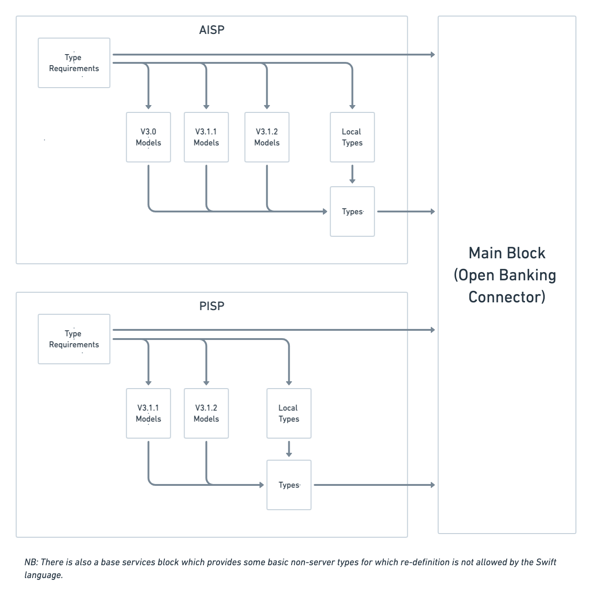

# Block Architecture

Open Banking Connector is designed with a block (module) architecture to aid:
* Maintainability
* Code Re-use
* Customisation

Using blocks also allows for explicit dependency management, parallel development, as well as hopefully better tooling support (e.g. build times).

For Open Banking Connector, the block architecture is based on the following ideas:
* Open Banking models (data types) are kept separate from the server code that provides the main functionality of Open Banking Connector. This allows the models to have minimal dependencies and be re-used e.g. in other backend components or client apps (web, mobile) which process Open Banking data.
* Local types (version-independent variants of Open Banking models used for requests and responses to and from Open Banking Connector) are also kept separate from the server code as well as kept in dedicated block(s) to allow for customisation and re-use in e.g. other backend components or client apps (web, mobile) which connect to Open Banking Connector
* Separately for AISP and PISP:
    * Requirements on data types (models) for each Open Banking AISP/PISP standard version are placed in a requirements block. These requirements are used to unify differences across AISP/PISP standard versions and present a version-independent set of models.
    * Auto-generated models for each AISP/PISP standard version are placed into their own block with conformances to the requirements mentioned above
    * A types block provides all required access to the models across all supported standard versions whilst hiding any information about which standard versions are supported (so when adding a new standard version, nothing beyond this block need be modified). This block "hides" the standard version-specific blocks.
    * Local types are customisable but constrained by requirements included alongside those for the models.

## Block Diagram

THe following diagram show the blocks and dependencies of Open Banking Connector.

